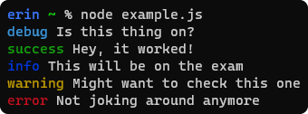

# another-logger [](https://www.npmjs.com/package/another-logger) [](https://www.npmjs.com/package/another-logger/v/next)

Lightweight, level-based console wrapper intended for small projects and general-purpose event logging. Yet another `console.log` alternative. Inspired by the looks of [Yarn](https://yarnpkg.com/).

<p align="center"></p>

## Installation

```bash
# yarn
yarn add another-logger
# npm
npm install --save another-logger
```

To install without installing [`chalk`](https://npmjs.com/package/chalk) (the package used for color support), add `--no-optional` to the end of either of these commands.

## Usage

For usage examples in Javascript and Typescript, see [the examples folder](/example).

## Documentation

### `const log = require('another-logger')(config);`

Requiring the module gives a function that can be called to create logger instances. When calling the function, the argument `config` is an object with the following properties:

- `timestamps` - True or false. If true, a timestamp is included in front of all output.

- `levels` - An object of additional levels to add to the logger. Each key of the object is the name of a logger, and the value should be another object with the following keys:

	- `text` - Custom text to display for this level. If omitted, the name of the level is used (which is sufficient most of the time).

	- `style` - The style to use for displaying this level's name. This can be a function or a string; if it's a string, it will be parsed as a space- and/or period-separated list of [`chalk`](https://npmjs.com/package/chalk)'s named styles (red, gray, bgBlue, etc). See that package's README for a full list.

	- `stream` - The stream this log should output to. Overrides the logger setting on a per-level basis.

	Note that the `levels` object can optionally be passed as a second argument to the function rather than as a key of the main config object. This can be useful if you import config options but want to override the levels per-file, for example.

- `ignoredLevels` - An object representing levels to ignore. Level names are keys, and values should be truthy if the level is ignore and falsy if not.

  Alternatively, an array of level names (strings) can be passed. All levels in the array will be ignored.

  These levels will not error, but won't write anything to the console when they're called, either. Useful for debug levels that shouldn't show anything in production.

- `label` - A label to print along with all output. Note that this can also be specified as a first argument in the constructor; if both are specified, the positional argument takes precedence over the object property.

If you want to reuse configuration options across your project without duplicating them into every file where you create a logger, you can also create a file called `logger.config.js` or `logger.config.json` in the directory where your project is run. The package will look for this file when creating new loggers and use it as a list of default options. Options specified in this way can still be overridden on a per-logger basis by passing different options to the logger function.

### `const log = require('another-logger');`

The exported function also has all the properties of a logger created with no options, which means that you can use it as a "default" logger. Using the module in this way will still respect options from `logger.config.js[on]`.

### `log.<name>(content...);`

Execute a log. `name` can be any level name - one of the defaults of `debug`, `info`, `success`, `warn`, or `error`, or a custom one provided in the logger's config. Content arguments are processed via `require('util').format()` which means it works in the same way as `console.log` in regards to format strings, object previewing, etc.

### `log.<name>.trace(content...);`

Emulates `console.trace`. The same as the normal log, but appends a stack trace to the log output.

### `log.<name>.table(tabularData, properties?);`

Emulates `console.table`. Tries to generate and display a table from the object or array `tabularData`, displaying only properties whose names are in `properties` if it is passed. Logs the argument plainly if a table can't be generated. Throws an error if `properties` is given and is not an array of strings. For more information, see the [Node.js `Console.table` docs](https://nodejs.org/docs/v11.6.0/api/console.html#console_console_table_tabulardata_properties).

## License

MIT &copy; Geo1088
