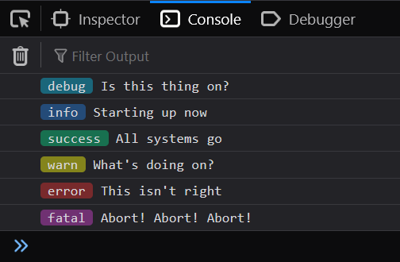

# another-logger [](https://www.npmjs.com/package/another-logger) [](https://www.npmjs.com/package/another-logger/v/next)

A lightweight yet highly configurable logging utility designed to make logs more accessible for projects of all sizes.

<p align="center">


</p>

## Installation

```bash
# yarn
yarn add another-logger
# npm
npm install --save another-logger
```

To install without installing [`chalk`](https://npmjs.com/package/chalk) (the package used for color support), add `--no-optional` to the end of either of these commands.

## Usage

For usage examples in Javascript and Typescript, see [the examples folder](/example).

## Documentation

needs to be written for v4

## License

MIT &copy; eritbh
