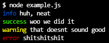
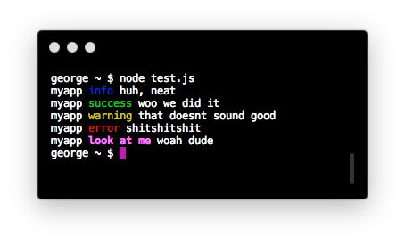

# another-logger [](https://www.npmjs.com/package/another-logger)

Yet another Node console.log alternative. Inspired by the looks of [Yarn](https://yarnpkg.com/).

## Installation

```bash
# yarn
yarn add another-logger
# npm
npm install another-logger
```

## Usage

```js
const Logger = require('another-logger')
const log = new Logger()

log.debug('test 123 foobar')
log.info('huh, neat')
log.success('woo we did it')
log.warn('that doesnt sound good')
log.error('shitshitshit')
```



```js
const Logger = require('another-logger')
const log = new Logger('myapp', {
	timestamp: true,
	minLevel: 0,
	levels: {
		custom: {level: 2, text: 'look at me', style: 'underline.bold.magenta'}
	}
})

log.debug('test 123 foobar')
log.info('huh, neat')
log.success('woo we did it')
log.warn('that doesnt sound good')
log.error('shitshitshit')
log.custom('woah dude')
```



## Documentation

### `Logger.defaultLevels`

The default log levels loaded in without any configuration. These will remain if you pass custom levels in to the constructor, unless you override them.

### `Logger.styleFrom([style])`

Takes a style as input. If the style is anything but a string, returns the input. If it *is* a string, returns the chalk style function of the same name. A string can include multiple style names by separating them with dots or spaces; that is, `styleFrom('green.bgBlue') === require('chalk').green.bgBlue`.

### `const log = new Logger([[label, ]config])`

Create a new logger instance.

`config` is an object with the following properties:

- `timestamp` - True or false. If true, a timestamp is included in front of all output.
- `minLevel` - The minimum numeric level to output. Any output from a level less than this will be omitted. Defaults to `1`, which includes everything except `debug` in the default levels.
- `maxLevel` - The maximum numeric level to output. Defaults to `Infinity`, i.e. there is no maximum.
- `levels` - An object of additional levels to add to the logger. For example:
- `label` - A label to print along with all output. Note that this can also be specified as a first argument in the constructor; if both are specified, the object property takes precedence.
- `labelStyle` - A style (a terminal style name as supported by chalk, or an arbitrary function) to apply to the label in the output.

```js
const myLogger = new Logger('global', {
  timestamp: true,
  levels: {
    messedItUp: {level: 2, text: 'problem:', style: 'magenta'}
  }
})
```

### `log.<name>(content...)` or `log._log(name, content...)`

Execute a log. `name` can be any level name - one of the defaults of `debug`, `info`, `success`, `warn`, or `error`, or a custom one provided in the constructor. Content arguments are processed via `require('util').format()` which means it works in the same way as `console.log` in regards to format strings, object previewing, etc.

```js
myLogger.messedItUp('some error info') //=> 15:47:13 global problem: some error info
```

Better documentation coming soon hopefully.

## License

MIT
